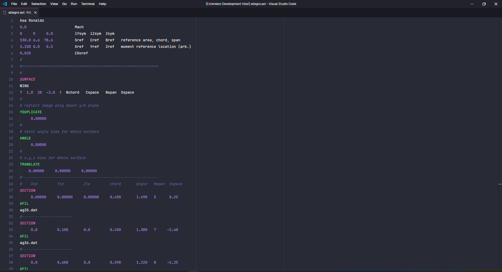

# AVL UFVoa

> A extensão AVL UFVoa é uma extensão para facilitar o uso do software Athena Vortex Lattice (AVL), que é um software para análise de aerodinâmica e dinâmica de voo.

### Autor
Esta estensão foi feita por [Caio Hilário](https://github.com/CaioVHilario), ex-capitão da equipe Skywards UFVoa da Univarsidade Federal de Viçosa.

### Contatos

 - [Instagram](https://www.instagram.com/ufvoa/)

## Features

 A extensão basicamente altera cores de números e funções usadas ao escrever a geometria de uma aeronave e possibilita comentar diversas linhas com o atalho de teclado do VScode e deixa o comentário com uma cor apagada, para facilitar a visualização do arquivo.

### 1.0.0

**Lançamento Inicial**
- Cores para o arquivo de geometria do AVL